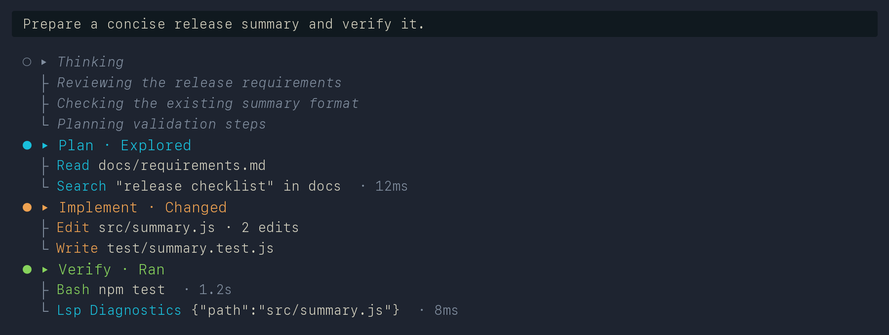

# Pi Glance UI

A [Pi](https://pi.dev) extension that makes long coding transcripts easier to scan while keeping complete tool detail available.



<sub>The screenshot uses synthetic prompts, paths, commands, and output.</sub>

## What it changes

- Groups recent actions into `Plan`, `Implement`, `Verify`, and other activity phases using Pi's public tool-rendering API.
- Formats the latest visible Thinking prose as a compact tree when the required version-scoped patches are enabled.
- Shows the command, path, query, or other useful argument for each action.
- Keeps complete tool output and artifact text available through expansion.
- Uses Pi's native expanded renderer for built-in tools, including terminal images.
- Tightens transcript spacing and simplifies Markdown headings and fenced code blocks in patched mode.
- Loads private renderer code only after version-scoped confirmation, then probes compatibility transactionally.

Glance UI changes transcript presentation only. It does not change how tools execute or what Pi stores in a session. Pi's public extension API supports custom tool rendering but not replacement of native transcript renderers, so the remaining presentation features use guarded, in-memory compatibility patches. See [Why private patches exist](docs/architecture.md#why-private-patches-exist).

## Requirements

- Node.js 22.19.0 or newer
- `@earendil-works/pi-coding-agent` 0.80.6
- `@earendil-works/pi-tui` 0.80.6

## Install

```bash
pi install git:github.com/Minh-Ng/pi-glance-ui@v0.2.7
```

Reload Pi after installation, then enable the version-scoped patches:

```text
/glance-ui patches on
```

> [!IMPORTANT]
> The patches are required for the complete Glance UI experience. Without them, only public compact rendering for built-in tools is available. Thinking trees and `Ctrl+T`, artifacts/custom messages, assistant/runtime error sections, rendererless custom tools such as TaskCreate/TaskUpdate, transcript spacing, and the complete `Ctrl+Shift+O` viewer all depend on patched Pi renderer hooks.

The command asks for explicit consent for the exact installed Pi version, probes compatibility transactionally, activates immediately, and persists the approved version. No Pi files are modified. Verify activation with `/glance-ui settings`; it must report `patches: on for Pi <version>`. A Pi upgrade invalidates prior approval until Glance UI explicitly supports and you approve the new version.

## Everyday controls

| Control | Action |
| --- | --- |
| `Ctrl+O` | Toggle full detail for completed tools and, with patches on, Thinking and artifacts |
| `Ctrl+T` | Show or hide Thinking when patches are on |
| `/sections` or `Ctrl+Shift+O` | Browse sections with an in-overlay detail viewer |
| `/glance-ui` | Open the interactive settings panel (↑↓ select · ←/→ or Enter change · Esc close) |
| `/glance-ui settings` | Print current settings and valid values as text |
| `/glance-ui patches on` | Enable the renderer patches required for the full UI |
| `/glance-ui patches off` | Use native transcript layout while retaining compact tools |
| `/glance-ui on` | Enable Glance UI rendering |
| `/glance-ui off` | Restore Pi's native transcript presentation immediately |

The section navigator orders blocks with the most recent at the top and older blocks toward the bottom. It renders the selected block beside the list (or full-width on narrow terminals). Use Left/Right or Tab to focus the section list or detail pane, Up/Down to select or scroll one line, Page Up/Page Down to scroll detail by page, Enter or Space to toggle the transcript section, and Escape to close.

Running tools use `auto` detail by default: the bottom-most running tool stays compact and completed output follows `Ctrl+O`. Other modes are covered in the [Power User Guide](docs/power-user-guide.md#running-tools).

Settings are saved to `~/.pi/agent/glance-ui.json`.

## Troubleshooting

- **Only built-in tools appear, or Thinking is absent?** Run `/glance-ui settings`. The full viewer requires `patches: on for Pi <version>`; enable it with `/glance-ui patches on`.
- **Need one hidden result?** Open `/sections`; the selected block is readable directly in its detail viewer.
- **Want native layout with compact tools?** Run `/glance-ui patches off`. Installed wrappers delegate immediately; after restart, no private patches are installed.
- **Want Pi's original presentation?** Run `/glance-ui off`. Existing and new transcript components switch immediately; `/glance-ui on` restores public compact tool rendering.
- **See “layout extras unavailable”?** A private renderer compatibility probe failed. The private layout transaction was rolled back; public compact tool summaries remain available where compatible.
- **Testing changes from a local package checkout?** Fully restart Pi after changing revisions. `/reload` hot-reloads auto-discovered extension directories, not package-installed local paths.
- **Setting was not saved?** Check that `~/.pi/agent` is writable. Glance UI reports when a change is session-only.

## Power users

See the [Power User Guide](docs/power-user-guide.md) for grouping rules, running-tool modes, section behavior, settings, and compatibility details.

Maintainers can consult the [Architecture and Maintenance Guide](docs/architecture.md).

## License

[MIT](LICENSE)
